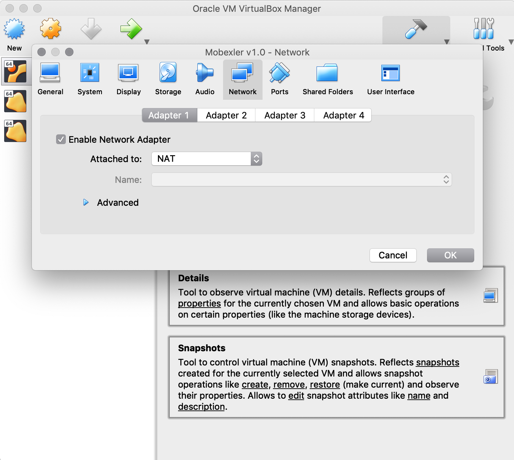

# Setting Up Penetration Testing Lab Using Mobexler

## Importing Mobexler As A Virtual Machine

    The default configuration:
    Hard Disk: ~50 GB
    Ram: 4 GB

Steps:

1. Download the ova file from links given above.

2. Install VirtualBox latest version available: Download Link

3. Once installed, start virtual box, go to File → Import Appliance → Select the
Downloaded OVA file →Click Import → Click Import.

|  |
| :--: |
| *Importing the downloaded OVA file* |

|  |
| :--: |
| *Select the default configuration* |

4.Once the virtual box image has been imported successfully,
go to Mobexler v1.0 → Settings → Network and confirm that one of the network
cards has NAT and other has Host Only Adapter connection.

Note: The name of Host Only Adapter can change depending upon the operating
system you are using and the name you have given to it.

|  |
| :--: |
| *NAT Adapter* |

|  |
| :--: |
| *Host-only Adapter* |

5.Start the Mobexler virtual machine, and login with the password: 12345

|  |
| :--: |
| *Login screen* |

6.Once logged in, verify if you can connect to the internet. Go to Applications →
Internet → Launch Firefox and open any website.

> Note: Mobexler comes preinstalled with Android Studio. But because of the
limitation of running an ARM based emulator inside the virtualbox, the emulator
becomes extremely slow (10 times slower). Due to this reason, we strongly
suggest setting up the lab using Genymotion as the emulator, or using any
real android device as the test device.

## Setting Up Genymotion As a Test Device/Emulator

Steps:

1. Go to the Genymotion Website and download a “Genymotion For Fun” application →
Genymotion For Fun.

2. Installed the downloaded application, register/sign in to free account and
launch “Genymotion” from application/program list.

    | |
    | :--: |
    | *Genymotion Application Showing List Of Available Emulators* |

    > Note: For testing, you are free to download and setup any available genymotion
    > image. In this tutorial, we will use “Google Nexus 5X - 7.0 API 24”.

3. Now from the genymotion application, select the device
“Google Nexus 5X - 7.0 API 24” → Install

    | |
    | :--: |
    | *Installting Emulator* |

4. Once the Genymotion device image has been downloaded,
run the image to make sure it’s working fine.

    |  |
    | :--: |
    | *genymotion* |

5. Now, go to the website ​<https://apkpure.com/​> and download the APK for
“Wifi  ADB” application.

6. Link: ​<https://apkpure.com/search?q=wifi+adb>

    | |
    | :--: |
    | * * |

7. Once the apk is downloaded, simply drag and drop the apk over the running
Genymotion Device. This will install and launch the application, Wifi ADB.
8.Now, go to setting of Android Emulator → WiFi settings → Forget Wifi.

    | |
    | :--: |
    | * * |

8. Once the wifi has been disconnected, go to Wifi ADB application and select
the button to start Wifi over ADB. If asked for Root Permissions →
Select  Allow or Allow Always.

    | |
    | :--: |
    | *ADB over Wifi started* |

9. Ensure that the ADB is running over a wifi address which is on
“Host-only  Adapter”, generally it will start with 192.168.X.X

10. Go to Mobexler → Launch Terminal from Dock at bottom → Enter the
command “adb connect IP:PORT”. Here, IP:PORT is the IP address and port
which is showing on Wifi ADB application.

    | |
    | :--: |
    | *Genymotion Connected to Mobexler through ADB* |

11. Launch Android Studio, from Applications → Android Zone → Android Studio.

    | |
    | :--: |
    | *Android Studio Connected To Genymotion* |
